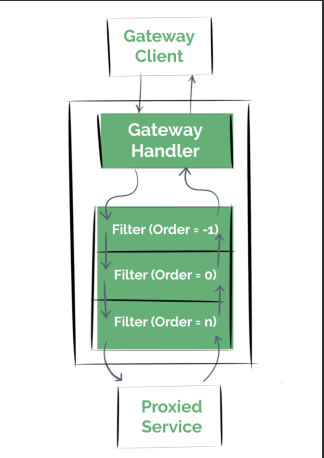

# Microservices

- Microservices are an architectural style where applications are
developed as a collection of small, loosely coupled, independently
deployable services.


## Characteristics of Microservices
- Small, focused on doing one thing well
- Independently deployable
- Organized around business capabilities
- Decentralized data management
- Communication via lightweight protocols (typically HTTP/REST)

## Comparison with Monolith
- Monolith: tightly coupled, single codebase
- Microservices: loosely coupled, multiple independent services

## Challenges of Microservices
- Increased complexity in managing multiple services
- Distributed System Issues like Latency, load balancing, network reliability, and consistency
- Managing transactions and consistency across services
- Handling communication protocols (REST, gRPC, messaging)
- Monitoring and Logging needs centralized monitoring and logging solutions

## Why use Microservices
- Scale services independently based on demand (e.g., scale only payment service during high traffic)
- Services can be written in different programming languages, suited to specific tasks
- Small teams can work on different services simultaneously, reducing time to market
- Failure in one service doesn't bring down the entire system
- Each service can be updated, deployed, and scaled independently
- Teams can work on different services without affecting each other

## Service Registry
- It is a central location all microservices will be registered here, and they can connect with the service registery to get the address of other service


## What is Service Discovery
- In a microservices architecture, each microservice is a standalone application with
specific business functionality. Since these microservices need to communicate with
each other to function as a complete application, they need to know each other's
network locations. Service Discovery comes into play here, maintaining a record of
these services' locations, helping them find each other, and enabling
communication.

## Spring Cloud Eureka(developed by netflix)
- Eureka is a REST based service which is
primarily used for acquiring information about
services that you would want to communicate
with. This REST service is also known as
Eureka Server. The Services that register in
Eureka Server to obtain information about each
other are called Eureka Clients.


## How Eureka Works

### Service Registration
A service registers itself with the Eureka Server upon startup.

### Heartbeat
The service sends heartbeats periodically to renew its lease with the Eureka Server.

### Service Discovery
Other services can query Eureka to discover the location (IP and port) of the registered service.

### Health Check
Eureka performs health checks to ensure that registered services are still healthy.

### Eviction
If a service stops sending heartbeats and its lease expires, the Eureka Server evicts it from the registry.

## Configuring the eureka server
- Add these config to your discovery service
```properties 
# do not register as client for eureka server
eureka.client.register-with-eureka=false
#do not fetch registry
eureka.client.fetch-registry=false
``` 
- Add necessary dependencies in the pom as listed
- eureka server dependency for the discovery service
- eureka client dependency for other services
- add spring cloud dependency management and its version in the pom
- Add these config to your other services
```properties
#let eureka client know where to find eureka server
eureka.client.service.url.defaultZone=http://localhost:8761/eureka/
```

## API Gateway

APIs are a common way of communication between applications. In the case of microservice architecture, there will be a number of services and the client has to know the hostnames of all underlying applications to invoke them.

To simplify this communication, we prefer a component between client and server to manage all API requests called API Gateway. Additionally, we can have other features which include:

* **Security** - Authentication, authorization
* **Routing** - routing, request/response manipulation, circuit breaker
* **Observability** - metric aggregation, logging, tracing


## Spring Cloud API Gateway

Spring Cloud API Gateway is a powerful, flexible solution for routing and proxying requests to downstream services in a microservices architecture. It handles several important tasks like routing, filtering, authentication, and load balancing.


- create a spring project with gateway, eureka client dependencies

## Spring Cloud Gateway Building Blocks

Spring Cloud Gateway consists of 3 main building blocks:

1. **Route**: The basic building block of the gateway. It consists of:
   - ID: Unique identifier for the route
   - URI: The destination URI where the request will be sent
   - Predicates: Conditions that must be met to match the route
   - Filters: Modify requests and responses before or after sending the downstream request

2. **Predicate**: Conditions that must be true for the route to be matched. Predicates can be based on:
   - Path
   - Method
   - Header
   - Query Parameter
   - Cookie
   - Host
   - Time

3. **Filters**: Allow modification of requests and responses. They can:
   - Add/Remove Headers
   - Add/Remove Parameters
   - Rewrite Paths
   - Set Status
   - Add Authentication
   - Rate Limiting
   - Circuit Breaking

Example Configuration:
```yaml
spring:
  cloud:
    gateway:
      routes:
      - id: order-service
        uri: lb://ORDER-SERVICE
        predicates:
        - Path=/api/v1/orders/**
        filters:
        - AddRequestHeader=X-Custom-Header, CustomValue
      - id: inventory-service
        uri: lb://INVENTORY-SERVICE
        predicates:
        - Path=/api/v1/inventory/**
```

## Spring Cloud Gateway Components in Detail

### 1. Route
Think of this as the destination that we want a particular request to route to. It comprises of destination URI, a condition that has to satisfy - or in terms of technical terms, Predicates, and one or more filters.

### 2. Predicate
This is literally a condition to match, i.e. kind of "if" condition. If requests has something - e.g. path=blah or request header contains foo-bar etc.

Examples of Predicates:
```yaml
# Predicates with path
- Path=/api/v1/orders/**

# Predicates with Method
- Method=GET

# Predicates with Header
- Header=User-Agent, Mozilla/*
```

### 3. Filter
These are instances of Spring Framework WebFilter. This is where you can apply your magic of modifying request or response. There are quite a lot of out of box WebFilter that framework provides.

Example Filters:
```yaml
filters:
  # Add a request header
  - AddRequestHeader=X-Request-Id, 12345
  
  # Add a response header
  - AddResponseHeader=X-Response-id, abcd
  
  # Redirect to another URL
  - RedirectTo=302, https://youtube.com
  
  # Strip prefix from path
  - StripPrefix=1
  
  # Remove a request header
  - RemoveRequestHeader=Cookie
```

## Spring Cloud Open Feign

Spring Cloud OpenFeign is a declarative HTTP client library for building RESTful microservices. It integrates seamlessly with Spring Cloud and simplifies the development of HTTP clients by allowing you to create interfaces that resemble the API of the target service. It abstracts away much of the boilerplate code typically associated with making HTTP requests, making your codebase cleaner and more maintainable.

### Adding OpenFeign Dependency

To use Spring Cloud OpenFeign, add the following dependency to your `pom.xml`:

```xml
<dependency>
    <groupId>org.springframework.cloud</groupId>
    <artifactId>spring-cloud-starter-openfeign</artifactId>
</dependency>
```

### Using OpenFeign

Here's an example of how to use OpenFeign in your microservices:

1. First, create a Feign client interface:

```java
@FeignClient(name = "order-service", path = "/orders")
public interface OrdersFeinClient {
    @GetMapping("/core/helloOrders")
    String helloOrders();
}
```

2. Use the Feign client in your controller:

```java
@RestController
public class InventoryController {
    private final RestClient restClient;
    private final OrdersFeinClient ordersFeinClient;

    @GetMapping("/fetchOrders")
    public String fetchFromOrderService(HttpServletRequest httpServletRequest) {
        log.info(httpServletRequest.getHeader("x-custom-header"));
        
        // Using Feign client instead of manual RestClient
        return ordersFeinClient.helloOrders();
        
        /* Alternative approach using RestClient:
        ServiceInstance orderService = discoveryClient.getInstances("order-service").getFirst();
        String response = restClient.get()
            .uri(orderService.getUri()+ "/orders/core/helloOrders")
            .retrieve()
            .body(String.class);
        return response;
        */
    }
}
```

The example above demonstrates how OpenFeign simplifies HTTP client code by:
- Declaring the API endpoint using annotations
- Automatically handling service discovery through the service name
- Eliminating boilerplate code for making HTTP requests
- Providing a clean, interface-based approach to defining API clients

## Eureka Instance Configuration

When services register with Eureka, they may face issues with hostname resolution, especially in Windows or Docker environments. By default, Eureka uses the machine's hostname (e.g., LAPTOP-XXXX.mshome.net) for registration, which can cause problems with service discovery.

To ensure proper service discovery and communication between services (especially for API Gateway and OpenFeign clients), add the following configuration to your service's `application.yml` or `application.properties`:

```yaml
eureka:
  instance:
    prefer-ip-address: true
```

Or in `.properties` format:
```properties
eureka.instance.prefer-ip-address=true
```

This configuration tells Eureka to register services using their IP addresses instead of hostnames, which helps resolve common service discovery issues and ensures that Feign clients and load balancers work correctly.

# Resilience4J

Resilience4j is a lightweight, standalone library designed for implementing resilience patterns in Java applications, particularly those using microservices architecture. It provides mechanisms to handle failures gracefully and ensures that services remain responsive under failure conditions. It's Key features are:

- Retry
- Rate Limiter
- Circuit Breaker
- Integration with Spring Boot:

## Retry

Resilience4J can help write logic for retry when a service call fails. This retries failed operations a certain number of times before giving up.

```java
@Retry(name = "inventoryRetry", fallbackMethod = "fallBackMethodReduceOrder")
```

```yaml
resilience4j:
  retry:
    configs:
      default:
        maxRetryAttempts: 3
        waitDuration: 5s
```

## Rate Limiter

Controls the rate of requests to a service by limiting the number of calls allowed during a specific time period.

```java
@RateLimiter(name = "inventoryRateLimiter", fallbackMethod = "fallBackMethodReduceOrder")
```

```yaml
resilience4j:
  ratelimiter:
    configs:
      default:
        limitForPeriod: 1         # Max 1 call in a refresh period
        limitRefreshPeriod: 5s    # Refresh the limit every 5 seconds
        timeoutDuration: 1s       # Time to wait for permission before a request fails
```

## Circuit Breaker

A Circuit Breaker is a resilience pattern that prevents a system from repeatedly trying to execute an operation that's likely to fail, allowing it to recover gracefully. It acts like an electrical circuit breaker: when failures reach a certain threshold, the circuit "opens" and blocks further attempts for a period of time. This helps avoid overwhelming a failing service and gives it time to recover.

### States of a Circuit Breaker:
- **Closed:** Requests flow as normal. If failures reach a threshold, the circuit transitions to Open.
- **Open:** Requests are immediately failed/skipped. After a timeout, the circuit transitions to Half Open.
- **Half Open:** Allows a limited number of test requests. If they succeed, the circuit closes; if they fail, it opens again.

Below is a typical state diagram for a circuit breaker:


You can visualize it like an electrical switch: when the circuit is closed, current (requests) flows; when open, it stops.

### Circuit Breaker using Resilience4j

You can implement the Circuit Breaker pattern in your Spring Boot application using Resilience4j's `@CircuitBreaker` annotation. This allows you to specify a fallback method when the circuit is open or a failure occurs.

```java
@CircuitBreaker(name = "inventoryFeignClient", fallbackMethod = "fallBackMethodReduceOrder")
```

Below is an example configuration for a circuit breaker instance in `application.yml`:

```yaml
resilience4j:
  circuitbreaker:
    instances:
      inventoryFeignClient:
        register-health-indicator: true
        sliding-window-size: 10
        failure-rate-threshold: 50
        wait-duration-in-open-state: 10000
        permitted-number-of-calls-in-half-open-state: 5
        sliding-window-type: COUNT_BASED
        minimum-number-of-calls: 5
        automatic-transition-from-open-to-half-open-enabled: true
```

**Explanation of key configuration options:**
- `register-health-indicator`: Enables health monitoring for this circuit breaker.
- `sliding-window-size`: Number of calls to consider for the failure rate calculation.
- `failure-rate-threshold`: Percentage of failures to open the circuit (e.g., 50%).
- `wait-duration-in-open-state`: Time (ms) the circuit stays open before transitioning to half-open.
- `permitted-number-of-calls-in-half-open-state`: Number of test calls allowed in half-open state.
- `sliding-window-type`: Can be `COUNT_BASED` or `TIME_BASED`.
- `minimum-number-of-calls`: Minimum number of calls before calculating failure rate.
- `automatic-transition-from-open-to-half-open-enabled`: Automatically transitions to half-open after the wait duration.

# API Gateway Filters

API Gateway filters are used to intercept, modify, and enhance requests and responses that pass through an API Gateway. They allow you to apply common cross-cutting concerns (such as authentication, logging, rate limiting, and transformation) at a centralized entry point before routing requests to microservices. There are two types of filters:

1. Global Filters
2. Route specific Filters



## Global Filter

All we have to do to create a custom global filter is to implement the Spring Cloud Gateway `GlobalFilter` interface, and add it to the context as a bean.

```java
@Component
public class FirstPreLastPostGlobalFilter implements GlobalFilter, Ordered {
    final Logger logger = LoggerFactory.getLogger(FirstPreLastPostGlobalFilter.class);

    @Override
    public Mono<Void> filter(ServerWebExchange exchange, GatewayFilterChain chain) {
        logger.info("First Pre Global Filter");
        return chain.filter(exchange)
            .then(Mono.fromRunnable(() -> {
                logger.info("Last Post Global Filter");
            }));
    }

    @Override
    public int getOrder() {
        return -1;
    }
}
```

This code defines a custom global filter for Spring Cloud Gateway:
- `@Component` registers the filter as a Spring bean so it is picked up automatically.
- The class implements both `GlobalFilter` (to define filter logic) and `Ordered` (to specify filter execution order).
- The `filter` method logs a message before and after the request is processed by the rest of the filter chain:
    - "First Pre Global Filter" is logged before passing the request down the chain.
    - "Last Post Global Filter" is logged after the response comes back up the chain.
- The `getOrder()` method returns `-1`, which determines the order in which this filter runs relative to other filters (lower values have higher precedence).

## Route Specific Filters

Global filters are quite useful, but we often need to execute fine-grained custom Gateway filter operations that apply to only some routes. These are called route specific filters.

To implement a `GatewayFilter`, we'll have to extend from the `AbstractGatewayFilterFactory` class provided by Spring Cloud Gateway.

### Example: Custom Route Filter


Here's a simple example of a route-specific filter that logs a message for each request:

```java
@Component
public class SimpleLogGatewayFilterFactory extends AbstractGatewayFilterFactory<Object> {
    private static final Logger logger = LoggerFactory.getLogger(SimpleLogGatewayFilterFactory.class);

    public SimpleLogGatewayFilterFactory() {
        super(Object.class);
    }

    @Override
    public GatewayFilter apply(Object config) {
        return (exchange, chain) -> {
            logger.info("Request received at: {}", exchange.getRequest().getURI());
            return chain.filter(exchange);
        };
    }
}
```

And in your `application.yml`:

```yaml
spring:
  cloud:
    gateway:
      routes:
        - id: log-route
          uri: http://example.org
          filters:
            - SimpleLog
```

# Centralized Config Server

Config Server is a dedicated service that acts as a centralized repository, allowing all microservices to retrieve their configurations dynamically at runtime.

Config Server can manage different environments (e.g., dev, test, prod) and profiles. This means that each environment can have its own set of properties (e.g., different databases or API keys).


## Setting Up a Spring Cloud Config Server

A Spring Cloud Config Server allows you to manage external properties for applications across all environments in a central place. It typically fetches configuration files from a remote repository (like GitHub), making it easy to update and manage configuration for multiple microservices.

### Steps
- Create a Spring Boot application and add `@EnableConfigServer` to the main class.
- Create a GitHub repository to store your configuration files.
- Add the `application.yml` (or `.properties`) file(s) for your services in this repo.
- Copy the repository URL.
- Create a GitHub API token: Go to Settings → Developer Settings → Personal Access Tokens → Generate new token, select the `repo` scope, and define the necessary permissions.


```

### Example `application.yml` for Config Server

```yaml
spring:
  application.name: config-server
  cloud:
    config:
      server:
        git:
          uri: https://github.com/Anuj-Kumar-Sharma/ecommerce-config-server
          username: anuj-kumar-sharma
          password: <your-github-token>
          default-label: master

server:
  port: 8888

eureka:
  client:
    service-url:
      defaultZone: http://localhost:8761/eureka
```

Replace `<your-github-token>` with your actual GitHub personal access token. This configuration connects your config server to a GitHub repository, sets the server port, and registers the config server with Eureka for service discovery.


